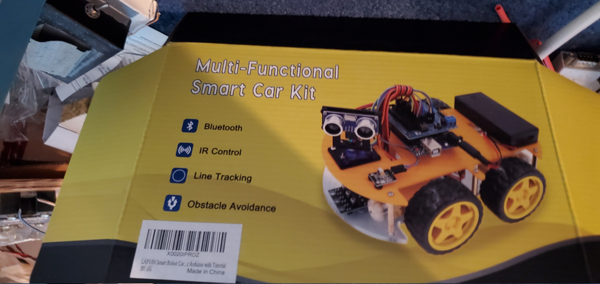
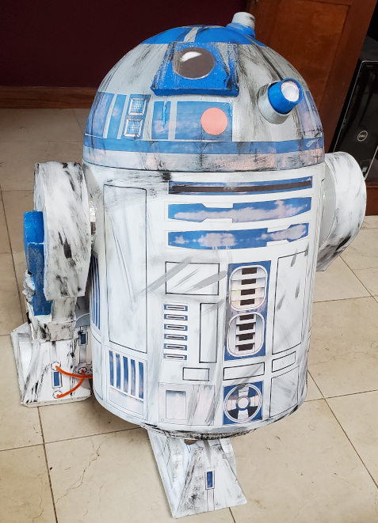
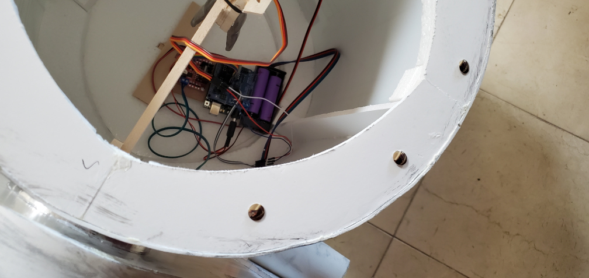
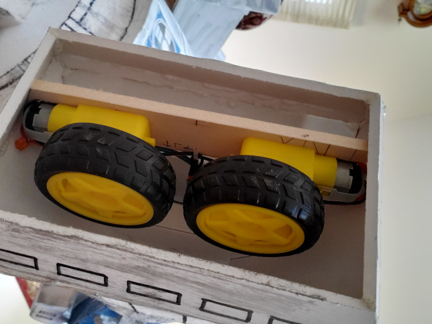

# R2Duino
Use an Arduino robot car kit to make a low-cost* operational R2D2.

Turn this ...
<!--  |  -->
  
into this ... 

by transplanting car parts into the body
<!--  |   -->
 
and feet
  
of an R2D2 shell.

# Version History

Version 1.22.7 7/22/22 basic version working (motors, head rotation)

# Reference Docs
- [Robot car kit](https://www.amazon.com/dp/B07JN46YSW), example kit that has nearly all the necessary parts
- [Head servo](https://https://www.amazon.com/dp/B07RFRLRV8), stronger servo needed for R2D2 head rotation (only 1 needed)
- [Arduino IDE](https://www.arduino.cc/en/Main/Software), R2Duino was tested with version 1.8.19

## eof
